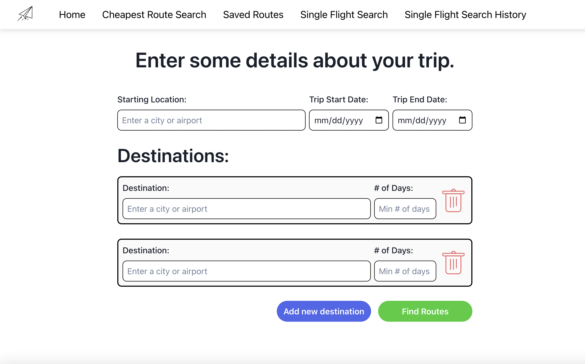
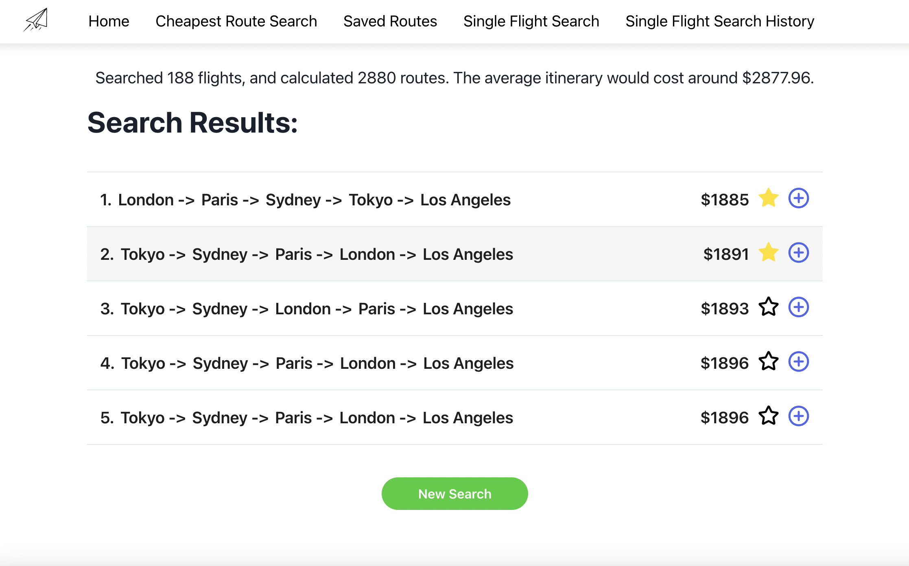
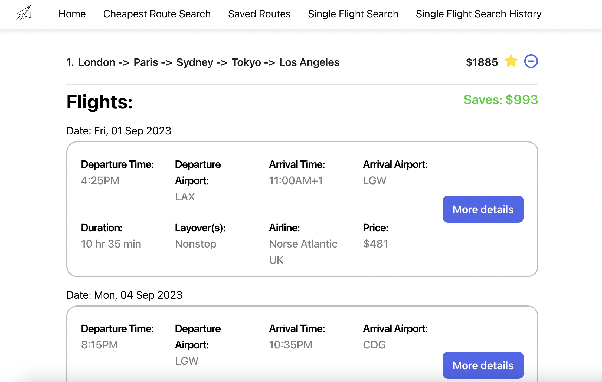

# FlightScraper
### Created by Adam Burnstine, 2023

FlightScraper is a web scraper app that allows avid world travelers to optimize their travel itinerary in order to save 10-30% on flights. It was developed using Python, Flask, React JS, and SQLite, and uses pyppeteer and beautiful soup to scrape dynamically rendered data from google flights.
 
### How to Use:
1. Enter your starting location and trip dates
2. Add a destination, using either the city name or its airport code
3. Choose the minimum number of days you want to spend in that city

4. Add as many destinations as you’d like. If you need to delete one, just click the red trash can.
Tip: Keep the total “Min # of Days” for your cities lower than the total length of your trip. The more flexible you are (lower minimum stays) the more FlightScraper can save you!
5. Click the “Find Routes” button
6. FlightScraper will scrape 1000+ flights and calculate 10,000+ routes to find the 5 cheapest itineraries that meet your criteria. Searching this much dynamically rendered flight data takes time. So please be patient
7. On the results page, click + to expand an itinerary and see the individual flights. Click the star to save it.

8. The "More Details" button will take you to Google Flights, where you can purchase the ticket for that leg of your trip.

9. Saved routes can be accessed on your Favorites page

### Single Routes: 
10. You can also search for a single flight on a specific date. A history of past single flight searches is available from the ‘History’ tab.

## Known bugs

1. The application scrapes data according to the structure of google flights website. Because of this it is extremely brittle and if anything changes in the structure of how google flights returns results, the application may be subject to many errors.
2. If the user enters a location that google isn't sure where it is, the search returns an error but doesn't give enough details about where the error arose to the user.

Copyright © 2020 Adam Burnstine 